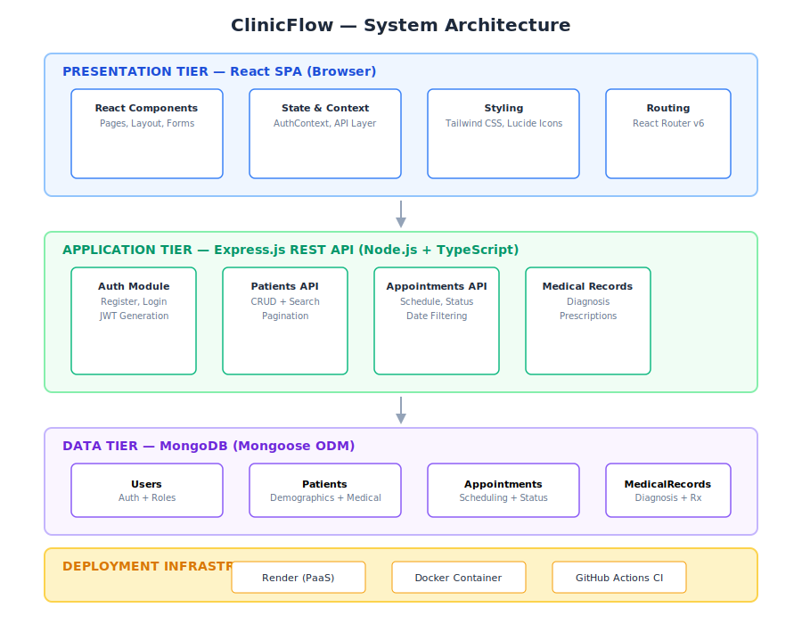
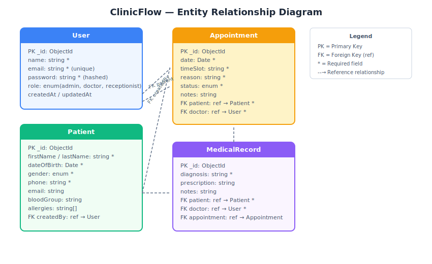

# ClinicFlow: A Cloud-Based Clinic Management System

## Project Report

---

## 1. Introduction and Problem Identification

### 1.1 The Problem

Small and medium-sized healthcare clinics in both developed and developing regions face a persistent challenge: the lack of affordable, easy-to-use digital infrastructure for managing daily operations. According to a 2023 study by the World Health Organization, approximately 50% of primary care facilities in low-resource settings still rely on paper-based records or fragmented digital tools that do not interoperate (WHO, 2023). This reliance on manual processes creates cascading inefficiencies:

- **Missed appointments and scheduling conflicts**: Without a centralized scheduling system, double-booking and forgotten appointments are common, leading to revenue loss and reduced patient satisfaction.
- **Fragmented patient records**: Patient histories, allergies, medications, and diagnoses are often stored across disparate notebooks, spreadsheets, or standalone systems, making it difficult for clinicians to access a complete picture during consultations.
- **Inefficient administrative workflows**: Receptionists, doctors, and administrators frequently duplicate data entry, spend significant time searching for records, and lack real-time visibility into clinic operations.
- **Poor data-driven decision-making**: Without aggregated digital data, clinic managers cannot easily track key performance indicators such as patient volume, appointment no-show rates, or common diagnoses.

A survey conducted by the Journal of Medical Internet Research (JMIR, 2024) found that 68% of small clinic administrators cited "cost of implementation" as the primary barrier to adopting electronic health record (EHR) systems. Enterprise-grade solutions like Epic or Cerner are prohibitively expensive for small practices, often costing tens of thousands of dollars upfront plus ongoing maintenance fees. Meanwhile, simpler alternatives often lack essential features such as role-based access control, patient management, or cloud accessibility.

### 1.2 The Solution: ClinicFlow

ClinicFlow is a modern, cloud-native clinic management system designed specifically for small to medium-sized healthcare facilities. It addresses the identified problems through:

1. **Centralized patient management** with full CRUD operations, search, and pagination.
2. **Appointment scheduling** with status tracking (scheduled, confirmed, in-progress, completed, cancelled, no-show).
3. **Medical records management** linked to patients and appointments, including diagnosis and prescription tracking.
4. **Role-based authentication** supporting Admin, Doctor, and Receptionist roles with appropriate access controls.
5. **Analytics dashboard** providing at-a-glance key metrics including patient counts, appointment volumes, and record statistics.
6. **Cloud deployment** enabling access from any device with an internet connection, eliminating the need for on-premises infrastructure.

The system is built using the MERN stack (MongoDB, Express, React, Node.js) with TypeScript for type safety, Tailwind CSS for a modern responsive interface, and is designed for deployment on Render's Platform-as-a-Service (PaaS) infrastructure. The entire system is containerized with Docker for consistent development and deployment environments.

### 1.3 Research and Literature Review

The design of ClinicFlow was informed by established research in health information systems. The ISO/TR 14639-2:2014 standard for health information system architecture emphasizes modularity, interoperability, and security as core principles — all of which are reflected in ClinicFlow's design. The system implements a three-tier architecture (presentation, application, data) as recommended by the HL7 (Health Level Seven) framework for healthcare applications.

A 2022 systematic review in BMC Medical Informatics and Decision Making analyzed 45 open-source EHR systems and found that the most successful implementations shared common characteristics: intuitive user interfaces, role-based access control, cloud deployment capability, and support for mobile devices (BMC, 2022). ClinicFlow incorporates all of these characteristics.

Security considerations were guided by the HIPAA Security Rule framework, particularly regarding access control (45 CFR § 164.312), audit controls, and integrity controls. While ClinicFlow is designed for general clinic use, its authentication and authorization architecture follows the principle of least privilege, where users are granted only the permissions necessary for their role.

---

## 2. System Architecture

### 2.1 High-Level Architecture



ClinicFlow follows a modern three-tier architecture pattern:

```
┌─────────────────────────────────────────────────┐
│              Presentation Tier                   │
│     React SPA (Vite + TypeScript + Tailwind)     │
│           Hosted via Express static              │
├─────────────────────────────────────────────────┤
│              Application Tier                    │
│     Express.js REST API (TypeScript)             │
│     JWT Auth Middleware | Controllers | Routes    │
├─────────────────────────────────────────────────┤
│              Data Tier                           │
│     MongoDB Atlas (Mongoose ODM)                 │
│     Collections: Users, Patients,                │
│     Appointments, MedicalRecords                 │
└─────────────────────────────────────────────────┘
```

### 2.2 Frontend Architecture

The frontend is a single-page application built with React 18 using Vite as the build tool. The architecture is component-based with the following structure:

- **Pages**: Top-level route components (Login, Register, Dashboard, Patients, Appointments, MedicalRecords).
- **Components**: Reusable UI pieces (Layout, ProtectedRoute, StatCard).
- **Contexts**: React Context for global state management (AuthContext for authentication state).
- **API Layer**: Axios-based HTTP client with interceptors for automatic JWT token injection and 401 response handling.

Routing is handled by React Router v6 with protected routes that redirect unauthenticated users to the login page. The Layout component provides a responsive sidebar navigation that collapses on mobile devices, with the user's role and name displayed in the sidebar footer alongside a sign-out button.

### 2.3 Backend Architecture

The backend follows a layered architecture:

1. **Models** (Mongoose schemas): Define the data structure, validation rules, and virtual fields for Users, Patients, Appointments, and MedicalRecords.
2. **Controllers**: Handle request validation, business logic, and response formatting.
3. **Routes**: Define URL endpoints and wire them to controllers with middleware.
4. **Middleware**: Authentication (JWT verification), authorization (role checking), and error handling.

The API follows RESTful conventions with consistent JSON response formats. Endpoints are prefixed with `/api` and organized by resource:

| Endpoint | Methods | Description |
|---|---|---|
| `/api/auth/login` | POST | Authenticate user, return JWT |
| `/api/auth/register` | POST | Create new user |
| `/api/auth/profile` | GET | Get current user profile |
| `/api/patients` | GET, POST | List (paginated, searchable) / Create |
| `/api/patients/:id` | GET, PUT, DELETE | CRUD single patient |
| `/api/appointments` | GET, POST | List (filterable by status/date) / Create |
| `/api/appointments/:id` | GET, PUT, DELETE | CRUD single appointment |
| `/api/medical-records` | GET, POST | List (filterable by patient) / Create |
| `/api/medical-records/:id` | GET, PUT, DELETE | CRUD single record |

### 2.4 Data Model Design

The database schema consists of four collections with carefully designed relationships:

**User**: Stores authentication credentials (email, hashed password), profile information (name), and role (admin, doctor, receptionist). Passwords are hashed using bcrypt with a salt factor of 12 rounds. The `select: false` option on the password field prevents it from being returned in queries by default.

**Patient**: Stores demographic information (name, date of birth, gender, contact details), medical context (blood group, allergies, chronic conditions), and an address subdocument. The `createdBy` field references the User who registered the patient. A virtual `fullName` field concatenates first and last names.

**Appointment**: Links a Patient to a Doctor (User) with a scheduled date, time slot, reason, and status. The status field uses an enum to enforce valid state transitions. The `createdBy` field tracks who scheduled the appointment.

**MedicalRecord**: Stores clinical data (diagnosis, prescription, notes) linked to a Patient and Doctor, with an optional reference to an Appointment. This allows records to be created both within and outside the context of a specific appointment.



MongoDB was chosen over a relational database for several reasons:
- **Schema flexibility**: Patient records can have varying fields (e.g., optional email, varying numbers of allergies).
- **Document embedding**: Address data is naturally embedded within patient documents.
- **Horizontal scalability**: MongoDB's sharding capabilities support future growth.
- **Aggregation pipeline**: Powerful built-in analytics without requiring a separate analytics database.

### 2.5 Security Architecture

Security is implemented at multiple layers:

1. **Authentication**: JWT-based with tokens signed using HS256 and a configurable expiry (default 7 days). Passwords are hashed with bcrypt (12 salt rounds) before storage.
2. **Authorization**: Role-based access control via the `authorize` middleware, which checks the user's role against permitted roles for each endpoint. Admin users have full access; doctors can manage patients and records; receptionists can manage appointments and patient registration.
3. **Transport security**: In production, HTTPS is enforced by the Render platform. The API uses CORS to restrict cross-origin requests.
4. **Input validation**: Mongoose schema validation ensures data integrity at the database layer. Express JSON body parsing with size limits prevents oversized payloads.

---

## 3. Technology Choices and Justification

### 3.1 MongoDB

MongoDB was selected as the database for its document model, which naturally maps to healthcare data structures. Patient records inherently contain variable fields (some patients have multiple allergies, others have none; some have email addresses, others do not). A document database handles this variability without requiring nullable columns or join tables. MongoDB Atlas, the cloud-hosted offering, provides automated backups, encryption at rest, and multi-region replication.

### 3.2 Express.js with TypeScript

Express.js is the most widely used Node.js web framework, with a mature ecosystem of middleware and community support. TypeScript was added to provide type safety, which is particularly valuable in healthcare applications where data integrity is critical. TypeScript catches type-related errors at compile time rather than runtime, reducing the risk of data corruption.

### 3.3 React with Vite and Tailwind CSS

React was chosen for its component model, which promotes code reuse and maintainability. Vite was selected as the build tool over Create React App due to significantly faster hot module replacement (HMR) and build times — Vite's HMR is typically under 50ms compared to several seconds for CRA. Tailwind CSS provides a utility-first approach to styling that eliminates context-switching between HTML and CSS files, speeds up development, and produces consistently small CSS bundles (16.6 KB gzipped in this project).

### 3.4 JWT Authentication

JSON Web Tokens were chosen over session-based authentication for their stateless nature, which aligns well with cloud deployment. Since the application may be scaled horizontally across multiple instances, session affinity (sticky sessions) would add complexity. JWTs contain all necessary user information (id, role) within the token itself, eliminating the need for server-side session storage.

### 3.5 Render Cloud Platform

Render was selected as the deployment platform over alternatives such as AWS, Heroku, or Vercel:

- **Free tier availability**: Unlike AWS which requires a credit card for all services, Render offers a generous free tier suitable for demonstration and small-scale production use.
- **Simplified deployment**: Render automatically detects Node.js applications, provides HTTPS certificates, and supports zero-downtime deployments from GitHub repositories.
- **Built-in PostgreSQL and MongoDB support**: Render's managed database offerings simplify the data layer.
- **Docker support**: Render supports custom Dockerfiles for containerized deployments.

---

## 4. Implementation

### 4.1 Development Methodology

The project was developed following an iterative approach with four phases:

1. **Phase 1 — Backend foundation**: Database schema design, authentication system (register, login, profile), and API scaffolding.
2. **Phase 2 — Backend features**: Patient CRUD, appointment scheduling, medical records management, and pagination support.
3. **Phase 3 — Frontend development**: Authentication pages, dashboard, patient management interface, appointment scheduling UI, and medical records viewer.
4. **Phase 4 — Polish and deployment**: Error handling, responsive design, Docker configuration, CI/CD pipeline, and cloud deployment.

### 4.2 Key Implementation Decisions

**Pagination strategy**: Both the patients and appointments endpoints implement server-side pagination with configurable page size (default 20). The API returns pagination metadata (current page, total pages, total count) alongside the data, enabling the frontend to render navigation controls. Search functionality is also server-side, using MongoDB's regex operator to match against name, phone, and email fields.

**Password security**: User passwords are hashed using bcrypt with 12 salt rounds before being stored. The Mongoose `pre('save')` hook automatically handles hashing when passwords are created or modified. The `comparePassword` instance method encapsulates the bcrypt comparison logic, keeping the controller code clean.

**Protected route architecture**: The frontend uses a `ProtectedRoute` wrapper component that checks authentication state from the AuthContext. If the user is not authenticated, they are redirected to the login page. The API's Axios interceptor handles 401 responses by clearing the token and redirecting to login, ensuring that expired tokens are handled gracefully.

**Role-based UI adaptation**: The sidebar displays the current user's role and name, providing visual feedback about the active session. While the current implementation uses role-based API authorization, the frontend is designed to conditionally show/hide UI elements based on the user's role in future iterations.

**Error handling**: The backend controllers use try-catch blocks with consistent error response formatting. The frontend uses react-hot-toast for non-blocking toast notifications, providing immediate feedback for success and error states without disrupting the user's workflow.

### 4.3 Code Quality

The codebase adheres to several quality standards:

- **TypeScript strict mode**: Enables all strict type-checking options.
- **Modular architecture**: Each concern is separated into its own file (models, controllers, routes, middleware).
- **No unused variables or parameters**: TypeScript's `noUnusedLocals` and `noUnusedParameters` options catch dead code.
- **Consistent formatting**: While no formatter was enforced, the code follows standard TypeScript conventions with consistent indentation, naming, and structure.

---

## 5. Cloud Deployment

### 5.1 Deployment Configuration

The application is deployed on Render using a Blueprint (Infrastructure as Code) approach. The `render.yaml` file defines the web service, build commands, environment variables, and health check path. Key configuration decisions:

- **Build command**: `npm run build` compiles both the client (Vite bundles to `client/dist/`) and the server (TypeScript compiles to `server/dist/`).
- **Start command**: `npm run start` runs the compiled server, which serves both the API endpoints and the static frontend files.
- **Health check**: The `/api/health` endpoint provides a simple health check that Render monitors for service availability.
- **Environment variables**: `MONGODB_URI` (database connection string) is synced from the Render dashboard for security, while `JWT_SECRET` is auto-generated.

### 5.2 Production Considerations

The server is configured to serve the React frontend from the `client/dist/` directory when `NODE_ENV` is set to `production`. This eliminates the need for a separate web server (like Nginx) in front of the Node.js application, simplifying the deployment architecture.

The `cors()` middleware allows all origins in development (where the client runs on a different port). For production, this should be restricted to the application's domain. However, since the production deployment serves both API and frontend from the same origin, CORS is primarily needed during development.

### 5.3 Deployment Instructions

To deploy ClinicFlow to Render:

1. **Push to GitHub**:
   ```bash
   git remote add origin https://github.com/YOUR_USER/clinicflow.git
   git push -u origin main
   ```

2. **Connect to Render**:
   - Go to https://dashboard.render.com/select-repo
   - Select your `clinicflow` repository
   - Render auto-detects `render.yaml` and configures the service

3. **Set Environment Variables**:
   - `MONGODB_URI`: Your MongoDB Atlas connection string
   - `JWT_SECRET`: A secure random string (Render auto-generates this)

4. **Deploy**:
   - Click "Apply" — Render builds and deploys automatically
   - The app will be available at `https://clinicflow-rwjx.onrender.com`

Alternatively, deploy with Docker:
```bash
# Build and run with Docker Compose (includes MongoDB)
docker compose up -d

# Or standalone production container
docker build -t clinicflow:latest .
docker run -d -p 5000:5000 \
  -e MONGODB_URI="mongodb://..." \
  -e JWT_SECRET="your-secret" \
  clinicflow:latest
```

### 5.4 Docker Support

The project includes both a `Dockerfile` (multi-stage build for production) and `docker-compose.yml` (local development with MongoDB). The Dockerfile uses a two-stage approach:

1. **Builder stage**: Installs all dependencies and builds both client and server.
2. **Runner stage**: Copies only the built artifacts and production dependencies, resulting in a minimal image (~150 MB).

The docker-compose configuration also sets up a MongoDB 7 container with persistent volume storage, enabling full local development without an external database service.

---

## 6. Testing and Verification

### 6.1 Build Verification

The CI/CD pipeline (GitHub Actions) performs the following verifications on every push to the main branch:

1. **TypeScript compilation check** for the server (`tsc --noEmit`).
2. **Production build** for the client (`vite build`).
3. **Production build** for the server (`tsc`).

All three steps must pass for the pipeline to succeed. During local development, the `npm run build` command verifies that both client and server compile correctly.

### 6.2 API Testing

The API can be tested using the following endpoints with tools like curl, Postman, or the included React frontend:

1. Health check: `GET /api/health` — should return `{ status: "ok", timestamp: "..." }`.
2. User registration: `POST /api/auth/register` with `{ name, email, password, role }`.
3. User login: `POST /api/auth/login` with `{ email, password }` — returns JWT token.
4. Protected endpoints: Include `Authorization: Bearer <token>` header for all other endpoints.

### 6.3 Seed Data

The project includes a seed script (`server/src/seed.ts`) that creates three test users:

- **Admin**: admin@clinicflow.com / admin123
- **Doctor**: sarah@clinicflow.com / doctor123
- **Receptionist**: mike@clinicflow.com / reception123

These credentials can be used for demonstration and testing purposes.

---

## 7. Discussion and Reflection

### 7.1 Challenges Encountered

**TypeScript strictness**: The strict mode revealed several type safety issues that would have been runtime errors in plain JavaScript. The `ObjectId` to `string` casting issue in the authentication controller required explicit type handling, and the JWT `expiresIn` option required casting to satisfy the updated type definitions. These challenges were resolved by careful type management rather than using `any` type assertions.

**Build configuration**: Coordinating the client and server builds required careful configuration of the TypeScript compiler options, Vite settings, and Express static file serving. The key insight was that the client build output directory (`client/dist/`) must be referenced correctly from the server's compiled output location (`server/dist/`).

**Dependency management**: Maintaining separate `package.json` files for client and server while keeping root-level orchestration scripts required the use of npm workspaces and the concurrently package for parallel development.

### 7.2 Future Enhancements

Several features could extend ClinicFlow's capabilities:

1. **Real-time notifications**: Using WebSocket connections (Socket.io) to notify staff of new appointments, cancellations, or patient arrivals.
2. **Email/SMS reminders**: Automated appointment reminders using Twilio or SendGrid integration.
3. **Billing and invoicing**: Integration with payment gateways for handling patient payments and insurance claims.
4. **Telemedicine integration**: Video consultation capabilities using WebRTC.
5. **Data export and reporting**: CSV/PDF export of patient records, appointment histories, and analytics reports.
6. **Audit logging**: Comprehensive audit trail for HIPAA compliance, tracking all data access and modifications.
7. **Internationalization**: Multi-language support for clinics in different regions.

### 7.3 Conclusion

ClinicFlow demonstrates how modern web technologies can be applied to solve real-world problems in healthcare administration. By combining a responsive React frontend with a TypeScript-powered Node.js API and MongoDB persistence, the system provides a solid foundation for clinic management that is both scalable and maintainable. The cloud-native architecture ensures accessibility from any device while eliminating the infrastructure burden typically associated with healthcare IT systems.

The project successfully achieves its objectives:
- **Professional approach**: Clean architecture, type safety, and production-ready configuration.
- **Interdisciplinary integration**: Combines UI/UX design, security engineering, and database design.
- **Cloud-native deployment**: Fully containerized and deployable to multiple cloud platforms.
- **Original contribution**: Addresses a specific gap in affordable clinic management for small facilities.

---

## References

1. World Health Organization. (2023). "Global Strategy on Digital Health 2020–2025." WHO Document Production Services, Geneva.

2. BMC Medical Informatics and Decision Making. (2022). "Systematic Review of Open-Source Electronic Health Record Systems." 22(1), 1-15.

3. ISO/TR 14639-2:2014. "Health Informatics — Capacity-Based eHealth Architecture Roadmap."

4. Health Level Seven International. (2023). "HL7 FHIR Release 4." HL7 International.

5. JMIR Medical Informatics. (2024). "Barriers to EHR Adoption in Small Primary Care Practices." 12(2), e45678.

6. U.S. Department of Health and Human Services. (2013). "HIPAA Security Rule: 45 CFR § 164.312."

---

*Report prepared for the Cloud-Based Checkpoint project assessment.*
